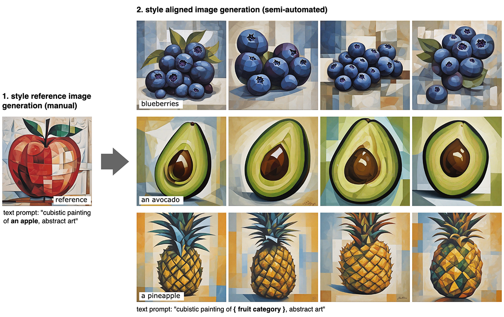

# fruit-SALAD


**fruit-SALAD** is a synthetic image dataset with 10,000 generated images of fruit depictions. This combined semantic category and style benchmark comprises 100 instances each of 10 easily recognizable fruit categories and 10 easy distinguishable styles. 

This repository contains the code to reproduce the fruit-SALAD dataset. Please see the jupyter notebook [fruit-SALAD_pipeline.ipynb](fruit-SALAD_pipeline.ipynb) for more details.    

### About
The carefully designed Style Aligned Artwork Dataset (SALAD) provides a controlled and balanced platform for the comparative analysis of similarity perception of different computational models. The SALAD framework allows the comparison of how these models perform semantic category and style recognition tasks, going beyond the level of anecdotal knowledge, making them robustly quantifiable and qualitatively interpretable.

We used [Stable Diffusion XL](https://arxiv.org/abs/2307.01952) and [StyleAligned](https://arxiv.org/abs/2312.02133) to create the fruit-SALAD by carefully crafting text prompts and overseeing the image generation process. Original code by [Amir Hertz](https://github.com/amirhertz), [Andrey Voynov](https://github.com/anvoynov) and [Yuvraj Sharma](https://github.com/yvrjsharma). See [github.com/google/style-aligned](https://github.com/google/style-aligned/).

Please note that this dataset is available for academic research purposes only.

### Dataset
You can access the complete fruit-SALAD_10k dataset at [Zenodo](https://doi.org/10.5281/zenodo.11158522).
```
Ohm, T. (2024). fruit-SALAD [Data set]. Zenodo. https://doi.org/10.5281/zenodo.11158522
```

### Cite
See our preprint on [ArXiv](https://arxiv.org/abs/2406.01278).
```
@misc{ohm2024fruitsalad,
      title={fruit-SALAD: A Style Aligned Artwork Dataset to reveal similarity perception in image embeddings}, 
      author={Tillmann Ohm and Andres Karjus and Mikhail Tamm and Maximilian Schich},
      year={2024},
      eprint={2406.01278},
      archivePrefix={arXiv},
      primaryClass={cs.CV}
}
```


